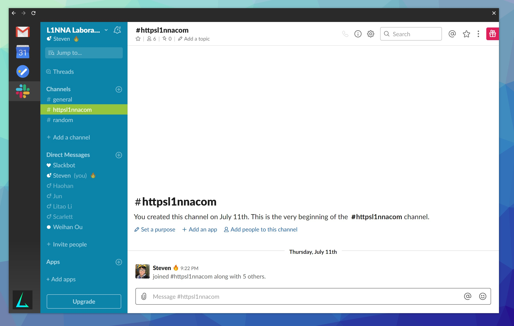

# L1NNA-TTTH


Unified workspace, so I don't need to find where the hell they are among all the chrome tabs/windows.



Configuration file is in ~/l1nna-settings.json

```json
[
    {
        "url": "https://www.gmail.com",
        "conf": {
            "id": "gmail",
            "title": "",
            "icon": "icons/gmail.png"
        }
    },
     {
        "url": "https://calendar.google.com/calendar/r",
        "conf": {
            "id": "gcalendar",
            "title": "",
            "icon": "icons/calendar.png"
        }
    },
     {
        "url": "https://freedcamp.com/dashboard",
        "conf": {
            "id": "freedcamp",
            "title": "",
            "icon": "icons/freedcamp.png"
        }
    },
     {
        "url": "http://l1nna.slack.com",
        "conf": {
            "id": "slack-l1nna",
            "title": "",
            "icon": "icons/slack.ico"
        }
    },
     {
        "url": "http://g33kw33kvi.slack.com",
        "conf": {
            "id": "slack-geekweek",
            "title": "",
            "icon": "https://g33kw33k.ca/2019/assets/img/beaver_mini.png"
        }
    },
     {
        "url": "http://github.com",
        "conf": {
            "id": "github",
            "title": "",
            "icon": "icons/github.jpg"
        }
    },
     {
        "url": "http://twitter.com",
        "conf": {
            "id": "twitter",
            "title": "",
            "icon": "icons/twitter.png"
        }
    },
     {
        "url": "https://music.youtube.com",
        "conf": {
            "id": "ymusic",
            "title": "",
            "icon": "https://open.scdn.co/static/images/favicon.png"
        }
    }
]
```
